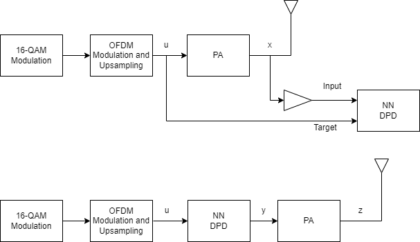

### Introduction

* This project presents a hardware-software co-design implementation of a neural network-based solution for applying digital predistortion (DPD) on RF signals to offset nonlinearities effects in power amplifiers, inspired by the approach detailed in this [MathWorks article](https://www.mathworks.com/help/deeplearning/ug/neural-network-for-digital-predistortion-design-offline-training.html).
* you can obtain the code in that article by running this command in matlab: `openExample('deeplearning_shared/NeuralNetworkDigitalPredistortionOfflineTrainingExample')`
* The power amplifier (PA) used here is a simulated version of the NXP™ Airfast LDMOS Doherty PA that you can access
from the same matlab script

- **`dnn.ipynb`**: Contains the neural network model (same structure as in the presceding article) written in Python using TensorFlow. 

- **`hls_fpga_accelerator.cpp`**: This file contains a hardware accelerator implemented in High-Level Synthesis (HLS) C++ and deployed on the Zynq UltraScale+ MPSoC SOM for inference **(achieved 47.2% reduction in inference time compared to the SoC CPU).**

The corresponding driver and PYNQ deployment code will be released soon. For early access, please reach out at [abood151103@gmail.com](mailto:abood151103@gmail.com).

### System Setup
Note: the upper part is the training setup and the other is for inference

### FPGA Block Diagram

